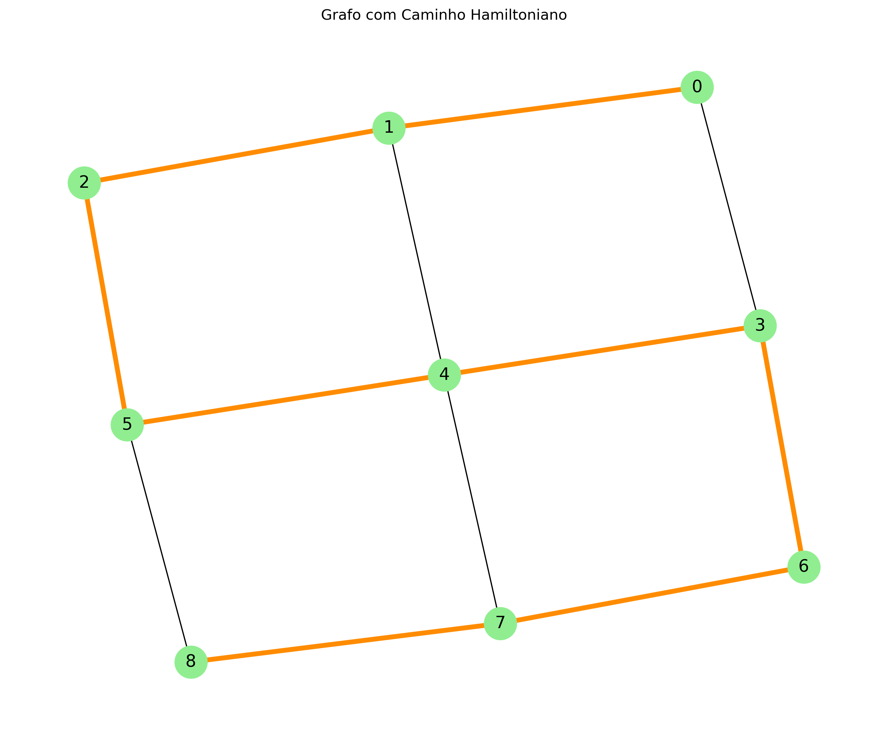

# Algoritmo para Caminho Hamiltoniano

Um **Caminho Hamiltoniano** é um conceito fundamental na teoria dos grafos que representa um caminho em um grafo que visita cada vértice exatamente uma vez. Diferente de um Ciclo Hamiltoniano, o caminho não precisa retornar ao vértice inicial. Este problema é um dos **problemas clássicos** NP-Completos e está intimamente relacionado ao Problema do **Caixeiro Viajante.**

## Descrição do Projeto

Este projeto implementa um algoritmo baseado em **backtracking** para encontrar um Caminho Hamiltoniano em grafos não direcionados representados por uma matriz de adjacência. A solução explora sistematicamente todas as possíveis permutações de vértices até encontrar um caminho válido ou esgotar todas as possibilidades.

## Como Executar o Projeto

### Pré-requisitos
```bash
pip install networkx matplotlib
```

### Execução do Algoritmo Principal
```bash
python main.py
```

### Visualização Gráfica
```bash
python view.py
```

## Exemplo de Saída
```
Matriz de adjacência:
[0, 1, 0, 1, 0, 0, 0, 0, 0]
[1, 0, 1, 0, 1, 0, 0, 0, 0]
[0, 1, 0, 0, 0, 1, 0, 0, 0]
[1, 0, 0, 0, 1, 0, 1, 0, 0]
[0, 1, 0, 1, 0, 1, 0, 1, 0]
[0, 0, 1, 0, 1, 0, 0, 0, 1]
[0, 0, 0, 1, 0, 0, 0, 1, 0]
[0, 0, 0, 0, 1, 0, 1, 0, 1]
[0, 0, 0, 0, 0, 1, 0, 1, 0]
Caminho Hamiltoniano encontrado:
0 -> 1 -> 2 -> 5 -> 4 -> 3 -> 6 -> 7 -> 8
```

### Visualização Gráfica (view.py)


## Descrição do Algoritmo (Linha a Linha)

### Arquivo: main.py

**Função `find_hamiltonian_path(graph)` (Linhas 1-8):**
- **Linha 2**: `n = len(graph)` - Obtém o número de vértices do grafo
- **Linha 3**: `path = [-1] * n` - Inicializa o caminho com valores -1 (não visitados)
- **Linha 4**: `path[0] = 0` - Define o vértice 0 como ponto de partida
- **Linhas 6-7**: Chama a função backtracking e retorna o caminho se encontrado

**Função `backtrack(graph, path, pos)` (Linhas 10-20):**
- **Linha 11**: `if pos == len(graph):` - Caso base: todos vértices foram visitados
- **Linha 12**: `return True` - Retorna sucesso quando caminho completo
- **Linha 15**: Loop por todos vértices como próximos candidatos
- **Linha 16**: `if is_valid(v, graph, path, pos):` - Verifica se vértice é válido
- **Linha 17**: `path[pos] = v` - Adiciona vértice ao caminho
- **Linha 18**: Chamada recursiva para próxima posição
- **Linha 20**: `path[pos] = -1` - Backtracking: remove vértice se não levar à solução

**Função `is_valid(v, graph, path, pos)` (Linhas 22-27):**
- **Linha 23**: Verifica existência de aresta entre vértices consecutivos
- **Linha 25**: Verifica se vértice já foi visitado
- **Linha 26**: Retorna True se vértice pode ser adicionado

## Relatório Técnico

### Análise da Complexidade Computacional

#### Classes P, NP, NP-Completo e NP-Difícil

O problema do Caminho Hamiltoniano se enquadra na classe **NP-Completo**:

- **Pertence a NP**: Dada uma sequência de vértices, podemos verificar em tempo polinomial O(n) se ela forma um caminho válido que visita cada vértice exatamente uma vez e possui arestas entre vértices consecutivos.

- **É NP-Difícil**: O problema é pelo menos tão difícil quanto qualquer problema em NP. Podemos reduzir o problema do Ciclo Hamiltoniano (que é NP-Completo) ao problema do Caminho Hamiltoniano em tempo polinomial.

- **Relação com o Problema do Caixeiro Viajante (TSP)**: 
  - O TSP é uma variação do problema Hamiltoniano onde buscamos um ciclo com custo mínimo
  - Ambos compartilham a mesma complexidade fundamental NP-Completo
  - Uma instância do TSP pode ser reduzida ao problema Hamiltoniano: se considerarmos um grafo completo com arestas de peso 1 para arestas existentes e peso infinito para arestas inexistentes, encontrar um ciclo Hamiltoniano equivale a resolver o TSP

#### Análise da Complexidade Assintótica de Tempo

**1. Complexidade Temporal**: O(n!)

**2. Método Utilizado**: Contagem de operações baseada na árvore de recursão combinada à análise do espaço de busca

- **Método principal**: Contagem de operações da árvore de recursão
- **Espaço de busca**: O algoritmo gera todas as permutações de n vértices = n! possibilidades
- **Custo por caminho**: Para cada permutação, verifica n-1 arestas = O(n) operações
- **Total**: **T(n) = n! × O(n) = O(n × n!) ≈ O(n!)** 

#### Aplicação do Teorema Mestre

**Não é possível aplicar o Teorema Mestre** ao algoritmo implementado.
O Teorema Mestre requer que o algoritmo siga o padrão de recorrência: **T(n) = aT(n/b) + f(n)**, porém, Nosso algoritmo de backtracking não divide o problema em subproblemas de tamanho n/b. A relação de recorrência é: **T(n) = n × T(n-1) + O(n)**, que não se encaixa no formato do Teorema Mestre. O algoritmo explora uma árvore de decisão combinatorial em vez de uma árvore de divisão e conquista.

#### Análise dos Casos de Complexidade

**1. Diferenças entre os Casos de Complexidade:**

**Pior Caso**:
- **Cenário**: Grafo quase completo sem caminho Hamiltoniano
- **Comportamento**: Algoritmo explora todas as n! permutações possíveis
- **Complexidade**: O(n!)

**Caso Médio**:
- **Cenário**: Grafo com densidade e estrutura variadas
- **Comportamento**: Explora parte significativa das permutações antes de encontrar solução
- **Complexidade**: O(n!)

**Melhor Caso**:
- **Cenário**: Primeiro caminho testado é válido OU grafo muito esparso sem solução
- **Comportamento**: Encontra solução rapidamente ou detecta inexistência
- **Complexidade**: O(n)

**2. Impacto no Desempenho do Algoritmo:**

- **Escalabilidade Limitada**: Natureza fatorial restringe aplicação a grafos pequenos (n ≤ 9)

- **Crescimento Explosivo**: 
  - n = 10 → ~3.6 milhões de operações
  - n = 15 → ~1.3 trilhão de operações  
  - n = 20 → ~2.4 quintilhões de operações

- **Conclusão**: O algoritmo é viável para instâncias pequenas; grafos maiores exigem heurísticas mais eficientes. A diferença extrema entre melhor caso (instantâneo) e pior caso (praticamente impraticável) demonstra a disparidade e a oscilação na performance.

## Referências:

1. **CARNEIRO ARAMUNI, J. P.** Fundamentos de Projeto e Análise de Algoritmos. Material de aula.
2. **AULA 02_Introdução à teoria da complexidade.pdf**. Material da disciplina PUC Minas.
3. **Repositório da disciplina**. Disponível em: https://github.com/joaopauloaramuni/fundamentos-de-projeto-e-analise-de-algoritmos
4. **Wikipedia**. Hamiltonian path problem. Disponível em: https://en.wikipedia.org/wiki/Hamiltonian_path
5. **Pesquisa Operacional II - Aula 26 - Caminhos e ciclos Euleriano e Hamiltoniano**. YouTube. Disponível em: https://www.youtube.com/watch?v=YWQQ-7U0PzU

